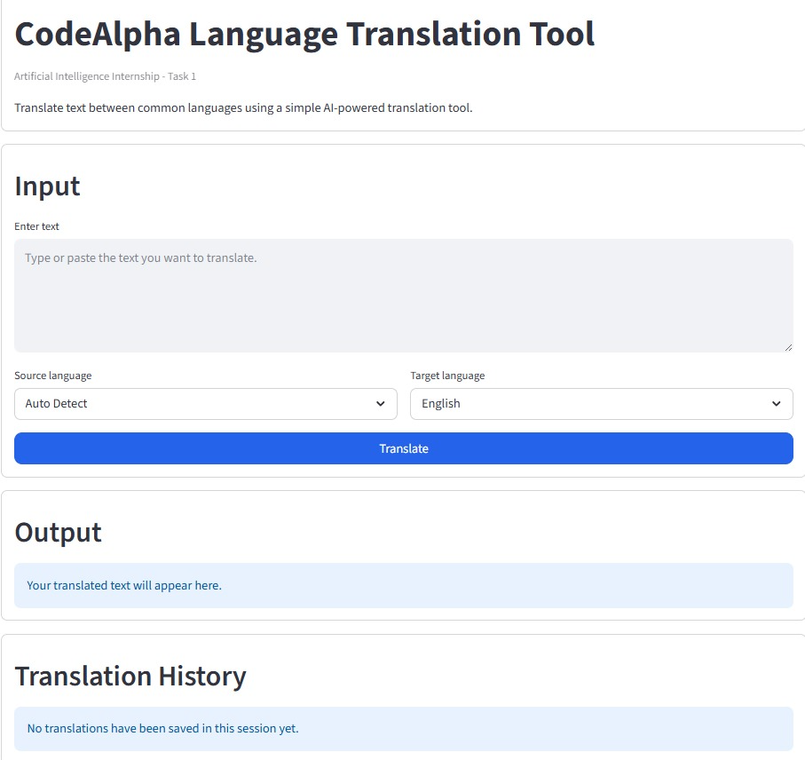
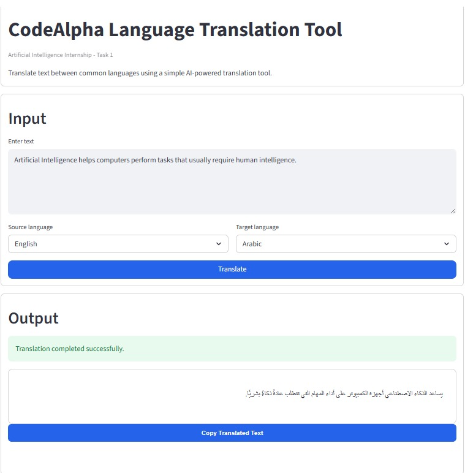
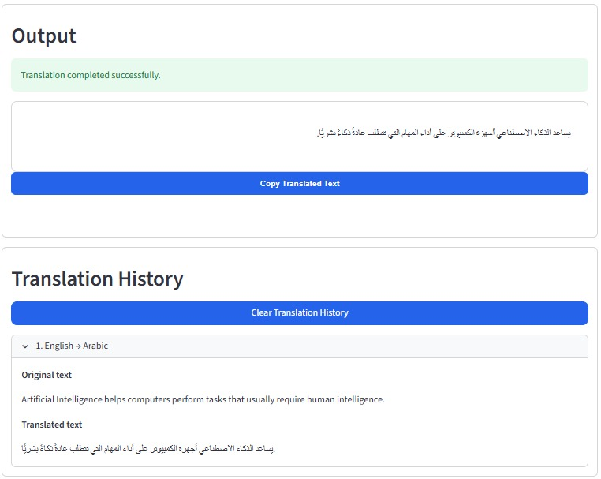

# CodeAlpha Language Translation Tool

## Internship Domain

Artificial Intelligence

## Task

Task 1 - Language Translation Tool

## Project Objective

The objective of this project is to build a simple language translation web app for the CodeAlpha Artificial Intelligence Internship. The app allows users to enter text, choose a source language, choose a target language, and view the translated result.

This project uses an existing translation service through the `deep-translator` package. No custom AI model was trained.

> Note: Translation accuracy may vary depending on the language and translation service.

## Features

- Clean and simple Streamlit interface
- Text area for entering text to translate
- Source language dropdown with Auto Detect support
- Target language dropdown without Auto Detect
- Clear translated text output
- Copy Translated Text button
- Friendly warning for empty input
- Friendly warning for selecting the same source and target language
- Graceful error handling for translation failures
- Translation history saved for the current session
- Clear Translation History button
- Somali language support
- Light and dark theme friendly styling

## Supported Languages

- Auto Detect
- English
- Somali
- Arabic
- Spanish
- French
- German
- Italian
- Portuguese
- Hindi
- Chinese Simplified
- Japanese
- Korean
- Russian
- Swahili
- Turkish

Auto Detect is available only in the source language dropdown.

## Technologies Used

- Python
- Streamlit
- deep-translator
- HTML/CSS customization
- Git
- GitHub

## Folder Structure

```text
CodeAlpha_Language_Translation_Tool/
|-- app.py
|-- frontend.py
|-- translator.py
|-- requirements.txt
|-- README.md
|-- .gitignore
|-- screenshots/
    |-- home_page.png
    |-- translation_result.png
    |-- translation_history.png
```

`app.py` starts the application, `frontend.py` contains the Streamlit user interface, and `translator.py` contains the translation helper functions.

## Installation Steps

1. Clone the repository:

```bash
git clone https://github.com/abdinasir600s-a11y/CodeAlpha_Language_Translation_Tool.git
```

2. Move into the project folder:

```bash
cd CodeAlpha_Language_Translation_Tool
```

3. Create a virtual environment:

```bash
py -m venv venv
```

4. Activate the virtual environment:

```bash
venv\Scripts\activate
```

5. Install the required packages:

```bash
py -m pip install -r requirements.txt
```

If your system uses `python` instead of `py`, use:

```bash
python -m venv venv
python -m pip install -r requirements.txt
```

## How to Run the App

Run the Streamlit app with:

```bash
streamlit run app.py
```

If `streamlit` is not recognized, run:

```bash
py -m streamlit run app.py
```

Then open the local URL shown in the terminal. It is usually:

```text
http://localhost:8501
```

## Screenshots

### Home Page



### Translation Result



### Translation History



## Demo Video

Add your demo video link here after recording the project walkthrough.

```text
Demo Video: Add your video link here
```

## Author

Name: Add your name here

Role: CodeAlpha Artificial Intelligence Intern

GitHub: [abdinasir600s-a11y](https://github.com/abdinasir600s-a11y)

## CodeAlpha Acknowledgement

This project was completed as part of the CodeAlpha Artificial Intelligence Internship.

Task: Task 1 - Language Translation Tool
